
<h1> Lab Report of Lab1.1 & Lab1.2 </h1>

## Lab1.1

In this part, the installation process of environment will be illustrated.  
The OS is ubuntu 16.04 (actually the lab1.1 is in 14.04, but it crashed several times, so I use 16.04 instead).  

### 1.Installation of Chrome
First, down load the installation packet of chrome.  
  
Then, install it. Chrome will be helpfull when we try to analyze the packet of our browser.  
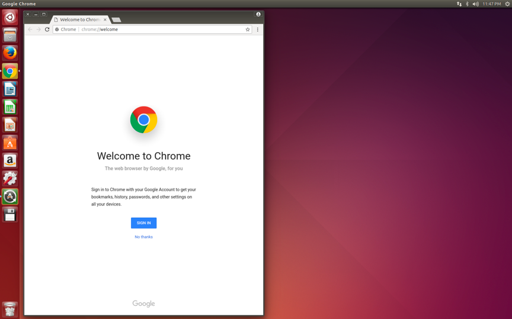  

### 2.Installation of JDK1.8.0
First, down load the installation packet of jdk1.8.0. Then release it and move the folder to /usr/local.  
Then, change the environmental variables and make a link to java binary file in /usr/bin.  
Here I will show the result directly.  
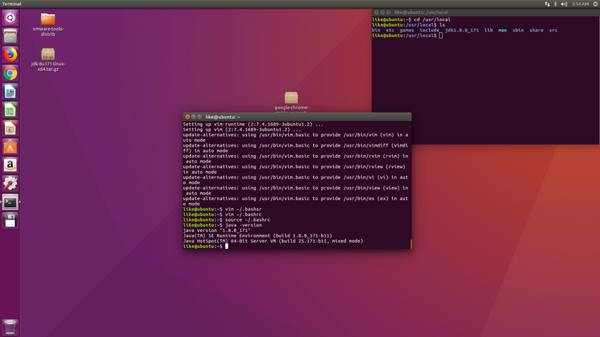  

### 3.Installation of Tomcat7.0
First, down load the tar.gz packet of tomcat7.  
  
Then, unpack it and move the folder to /usr/local. Remember to change the java path in catalina.sh. Start the service with ./startup.sh  
  
Successfully start!  
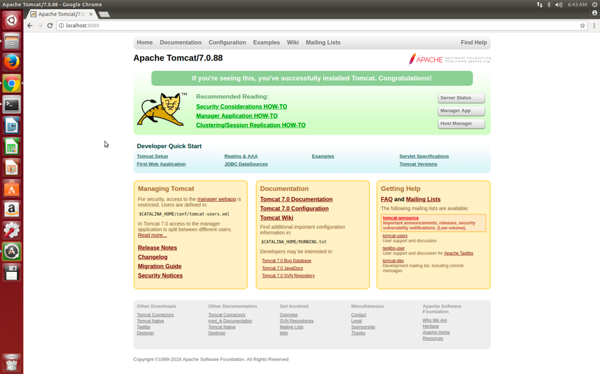  

### 4.Installation of Eclipse
First, down load the installatoin packet of eclipse.  
  
Then, install it.  
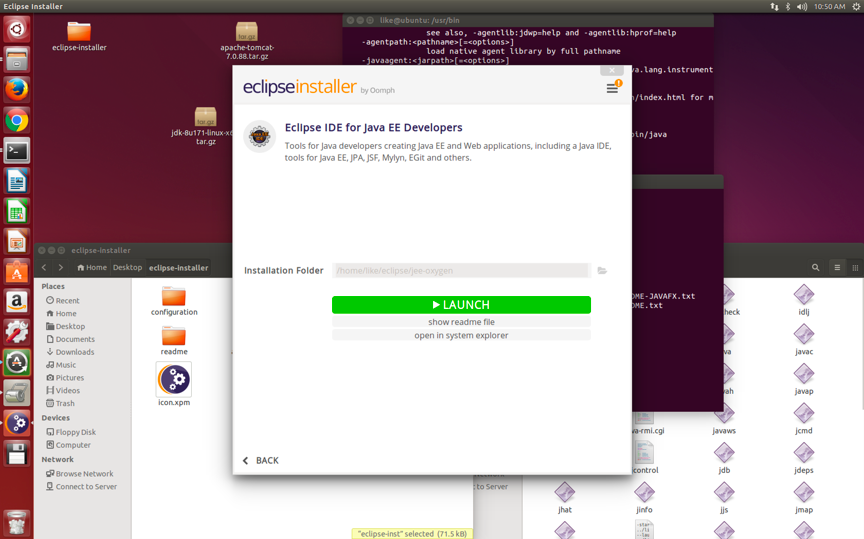  

### 5.Create HelloWorld Project
HelloWorld project of pure Java project.  
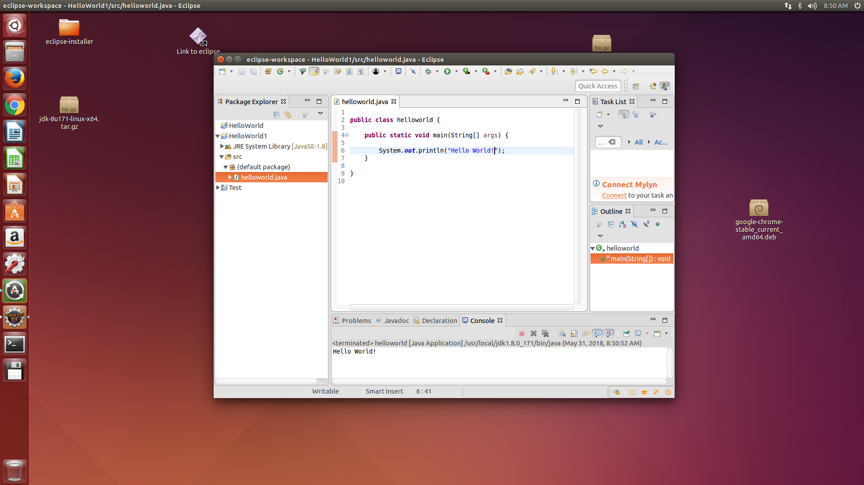  
HelloWorld project of Tomcat7 web project.  
  

## Lab1.2

### 1.Installation of MySQL
Use apt-get install mysql-server to install mysql.  
I'll show the result here directly.  
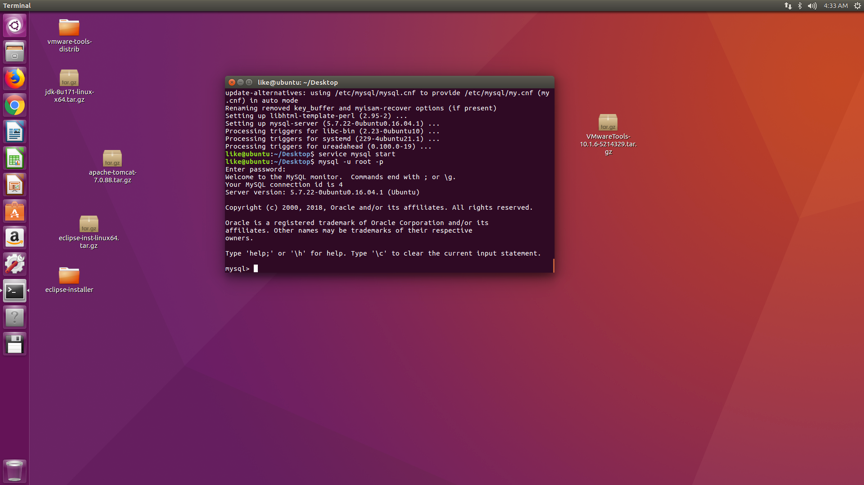  

### 2.Design of my web application

#### 2.1.Usage
My web application is going to be a simple library system.  
There are mainly two kinds of users, students and managers.  
The students will be able to search the books and borrow the books.  
The managers will be able to add books to the library.  

#### 2.2.Design

##### 2.2.1.JSP Architecture
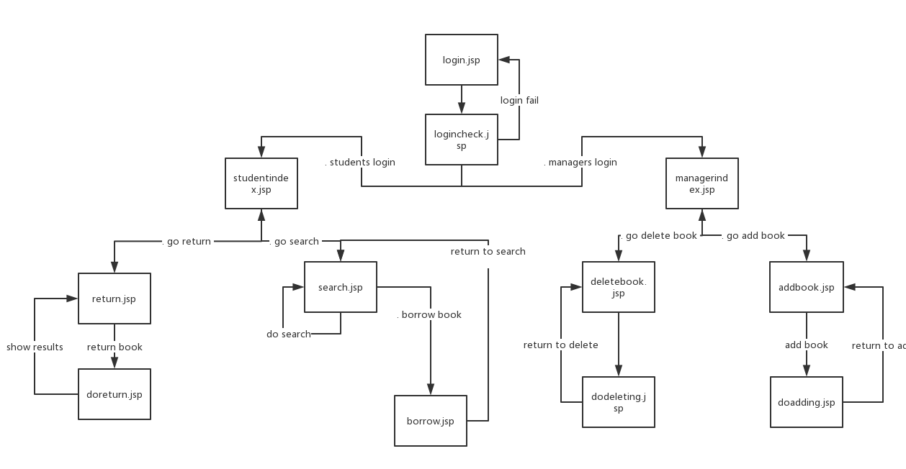  
Here is the instroduction to all jsp file.  
>__login.jsp__: Enter the username and password to login.  
__logincheck.jsp__: Check the username and password, return to login.jsp if failed, otherwise, go to studentindex.jsp or managerindex.jsp  
__studentindex.jsp__: Contains two buttons, return book or borrow book. The first button will go to return.jsp and the second will go to search.jsp.  
__return.jsp__: Here will list all the books a student have borrowed. By clicking the button goes after each book the student will return the book, which means go to doreturn.jsp.  
__doreturn.jsp__: Here is the place where actually do the return in database. Return to return.jsp after done.  
__search.jsp__: Enter the name of the book to search a book, and the search operations will be done in search.jsp. Also, a result will be list in this page. By clicking the button goes after each result, the student can borrow the book, which means go to borrow.jsp.  
__borrow.jsp__: Here is the place where actually do the borrow in database. Return to search.jsp after done.  
__managerindex.jsp__: Contains two buttons, delete book or add book. The first button will go to deletebook.jsp and the second will go to addbook.jsp.  
__deletebook.jsp__: Enter the name and number of the book to delete, and go to dodeleting.jsp.  
__dodeleting.jsp__: Do the deleting in database. Return to deletebook.jsp after deleting done.  
__addbook.jsp__: Enter the name and number and other properties of the book to add, and go to doadding.jsp.  
__doadding.jsp__: Do the adding in database. Return to addbook.jsp after adding done.  

At the same time, each jsp should be able to return to the index.jsp after login.  

##### 2.2.2.Class Architecture
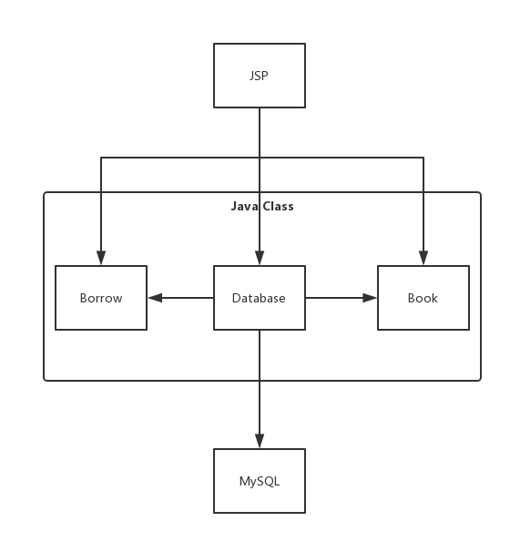  

JSP files will not connect to MySQL directly. The connection will be an entity of Class Database, and the operations to MySQL will be implement as functions in Class Database.  
Class Book is the model of book data structure, whose entities will be operated in Database and JSP.

### 3.Design of database
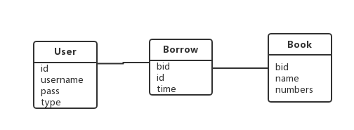  
A really simple database!

### 4.Implementation

#### 4.1.Implement database
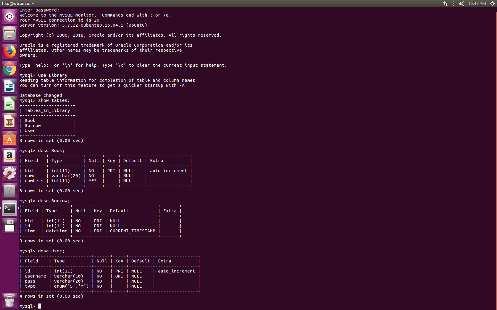  

#### 4.2.Implement project
Establish the server and the project.
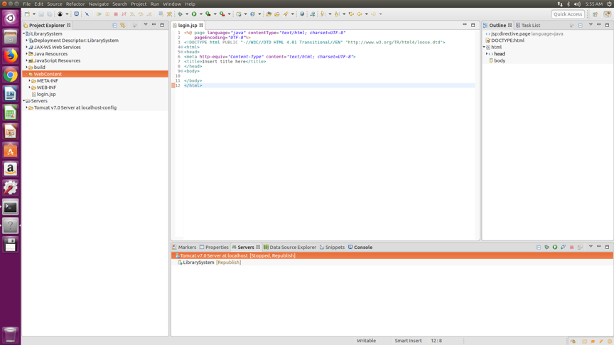  
Then, implement the jsp files. Here I will not show all the shotcuts of the operations. These files can be seen in code source. Instead, I'll instroduce something that is important in the implementation.

##### 4.2.1.Database Class & JDBC
Database Class is used to packet the opeartions with database. It imports JDBC and use the jar packet to connect with mysql. It has several functions:  
>__public void connect()__: This is used to make the connection with mysql.  
>__public void disconnect()__: And the disconnection with mysql.  
>__public int checkuser()__: This function is used to check whether the username and password is valid and correct. It will return 1 if the user is a student, 2 if the user is a manager, and 0 if the authentification fails.  
>__public Book[] searchbook()__: This function is used to search books. In the sql operation, I use like %% method, so that user can enter patial name of the book. The result will be returned as an array of Book entities.  
>__public boolean borrowbook()__: This function is used to make the borrow happen.  
>__private boolean insertborrow()__: This function will be called by borrowbook(). It will insert the borrow record in Borrow table.  
>__private int getuserid()__: Get the user id.  
>__public Borrow[] borrowlist()__: This function will return the borrow records of the user.  
>__public boolean returnbook()__: This function is used to make the return happen.  
>__private boolean doreturn()__: This function is used to delete the borrow record from Borrow table. If the user has multiple borrows with the same book, it will delete the first one in time order.  
>__public boolean addbook()__: This function is used to add a new book in Book table.  
>__public boolean deletebook()__: This function is used to delete a book with numbers in Book table.  
>__private boolean numbercheck()__: This function is used to check if the number of the book exit is larger or equal to number that is going to delete.

The __sql injection__ is taking into my consideration. All the input of users is add to sql operation as parameters instead of connecting strings.

##### 4.2.2.Cookie & Logout
Since our system need authentification, the cookie is needed to record the login status of users. The cookie I use is very simple.  
If the user pass the authenfication in logincheck.jsp, a cookie which is the username of the user will be added to response, with life time as 1 hour. And the cookie will go with all request after that.  
Each jsp after login will check whether the username cookie is not "". If the username cookie is "", it will return to login.jsp and ask user to relogin.  
Also, a logout.jsp is implemented to delete the cookie and return to login.jsp.  
Notice that, I use response and redirect to jump through jsp files, since the jsp:forward is a jumping operation in server, which will not return the Cookie back to browser.

##### 4.2.3.Information passing through jsp
When the user try to do any opearion in database, the system should return whether the operation is succeed or not.  
In this project, I simply pass the result as a parameter in request.  
You can find alert blocks in some jsp.

##### 4.2.4.Out link CSS file
I divide my jsp html part into two parts. There should be a navigator and a container. Navigator will show the username of current user and logout and index button. Container will include the main text that this jsp is going to show.  
You can find the css file at the same folder with jsp files, called mycss.css. I'm not good at write css, and the apperence of my jsp is really, ugly.

### Deploy & test

#### 1.Database Initialization
  
Since I don't realise the resiger funciton, I have to create two users, one student and one manager, first.

#### 2.Start Tomcat7 server
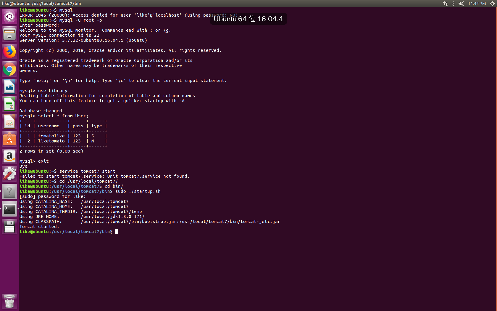  

#### 3.Login
  
##### 3.1.Student Login
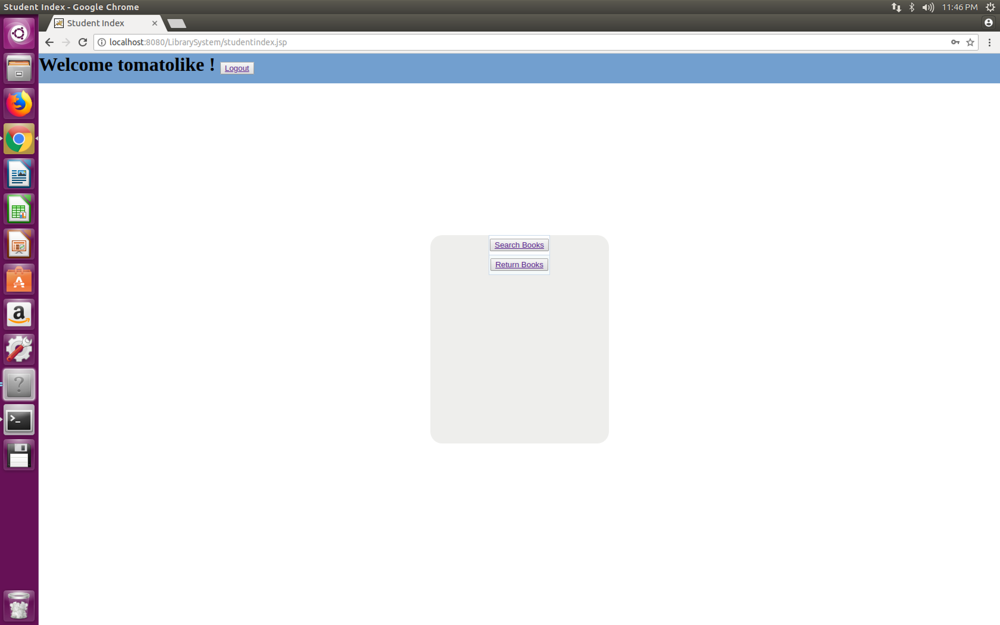  
##### 3.2.Manager Login
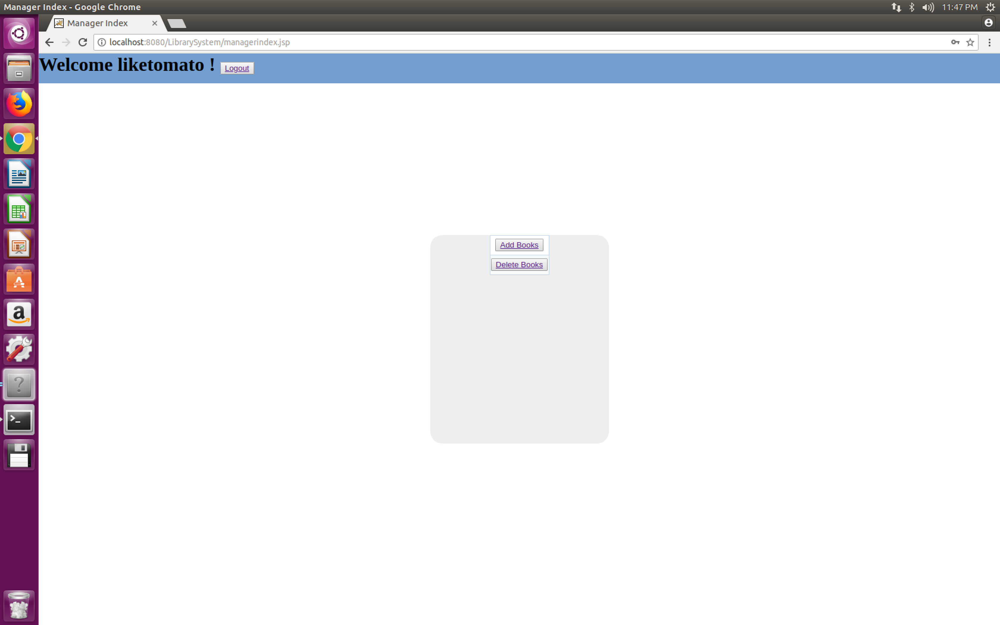  
##### 3.3.Login Failed
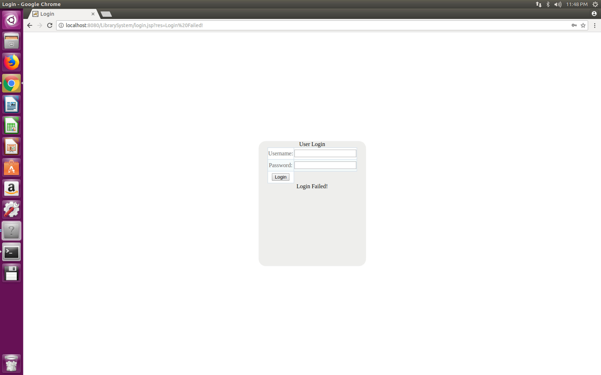  

#### 4.Student

##### 4.1.Search Book
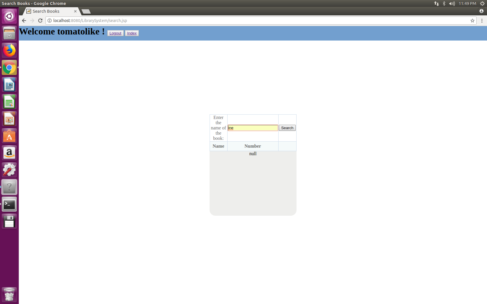  
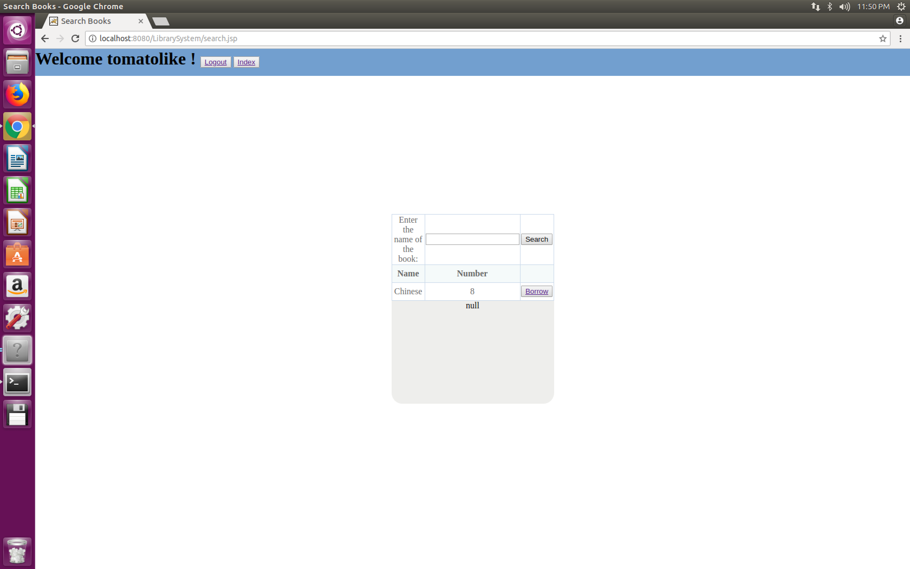  
Notice that I only enter "ine"

##### 4.2.Borrow Book
Just click the Borrow button after the search result.
  

##### 4.3.Return Book
First we can see the borrow record here.
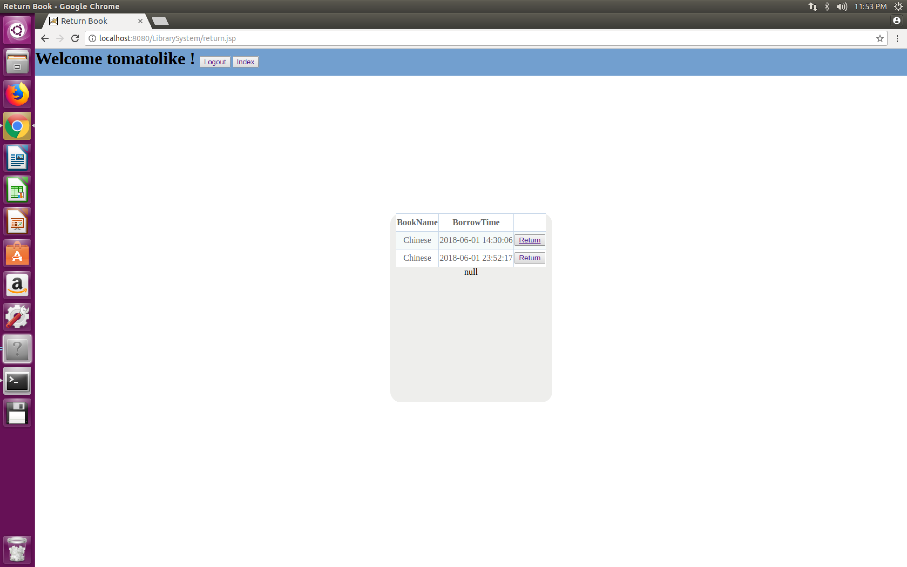  
Just click the return button after the borrow record.
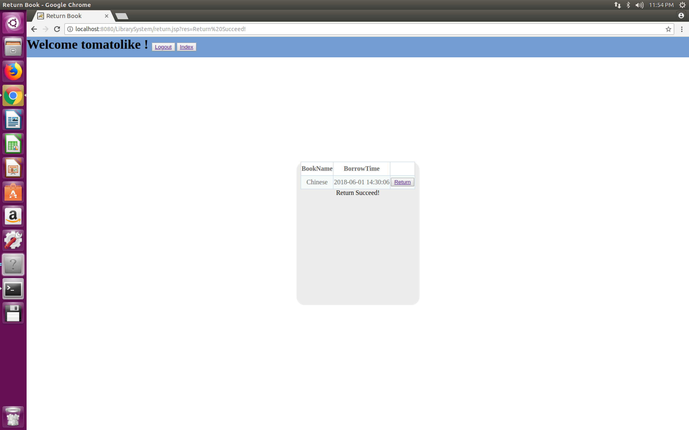  

#### 5.Manager

##### 5.1.Add Book
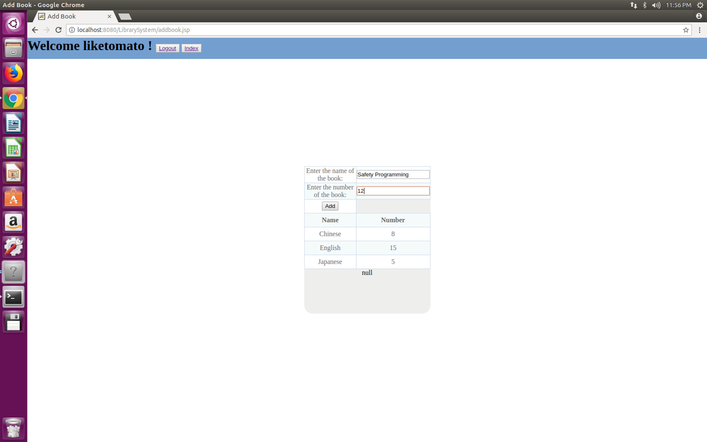  
Enter the name and number of the book you want to add.  
Notice that all books in library is list below.
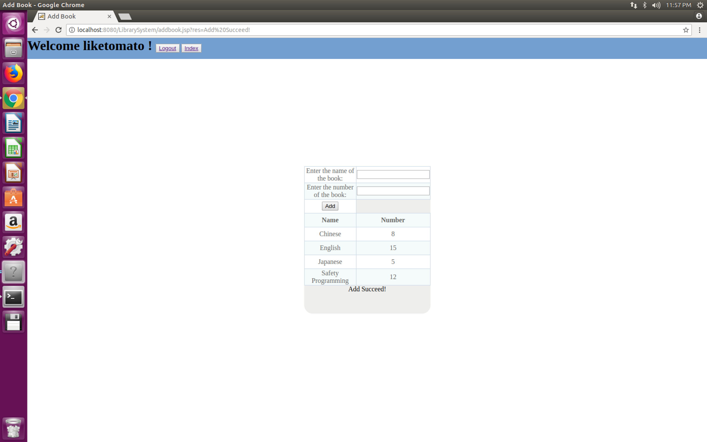  

##### 5.2.Delete Book
  
Enter the number you want to delete and click the button after that.  
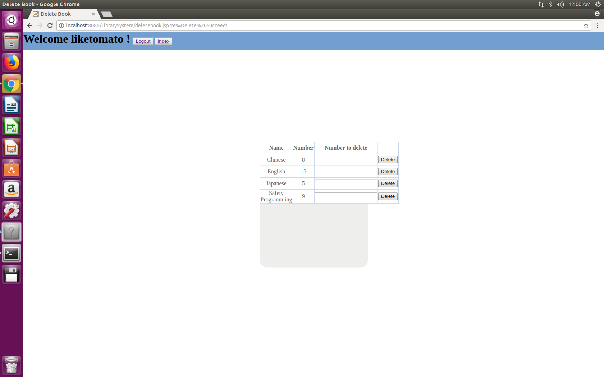  

### DrawBacks

#### 1.Unencryped Password
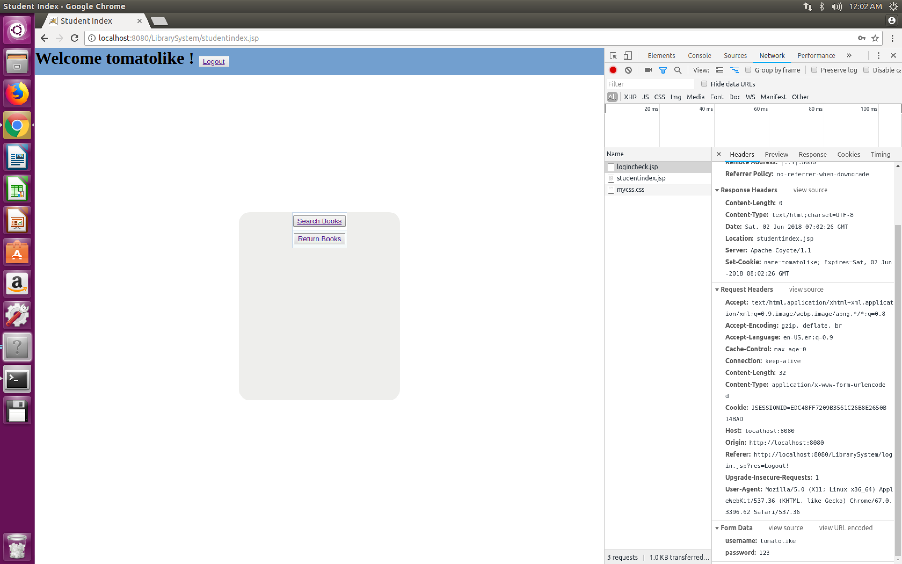  
You can see the username and password in the header.

#### 2.Buggy Logic
You cannot add numbers to exist book.  
You cannot totally delete a book from Book table.

#### 3.Ugly
That's true.
